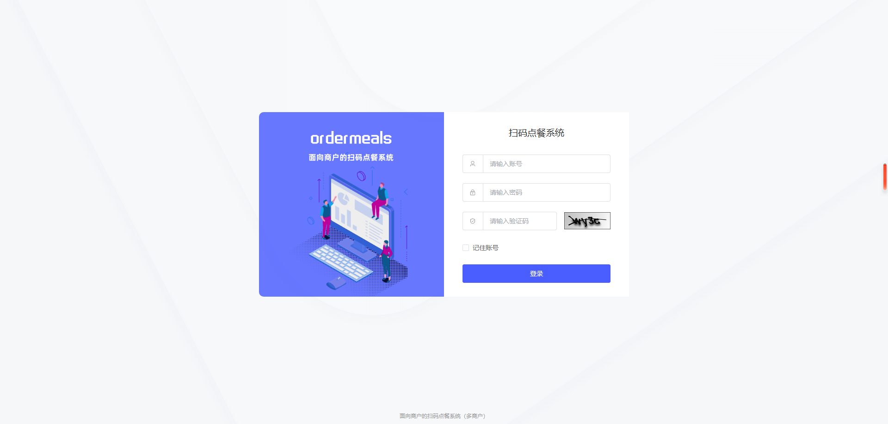
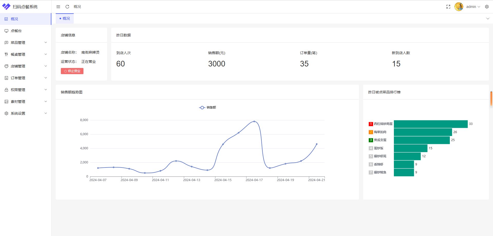
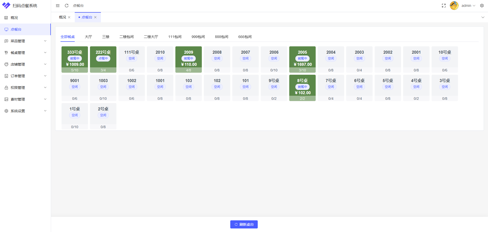
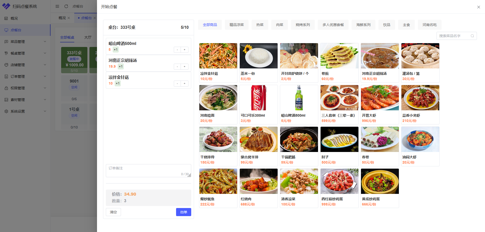
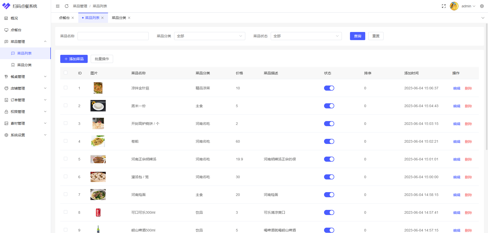
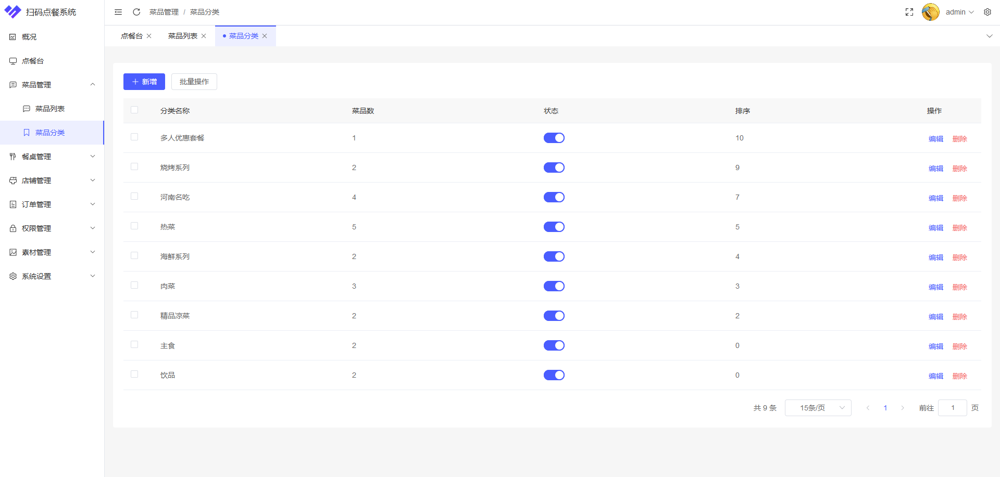
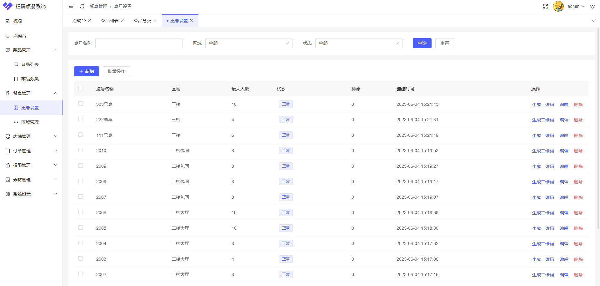
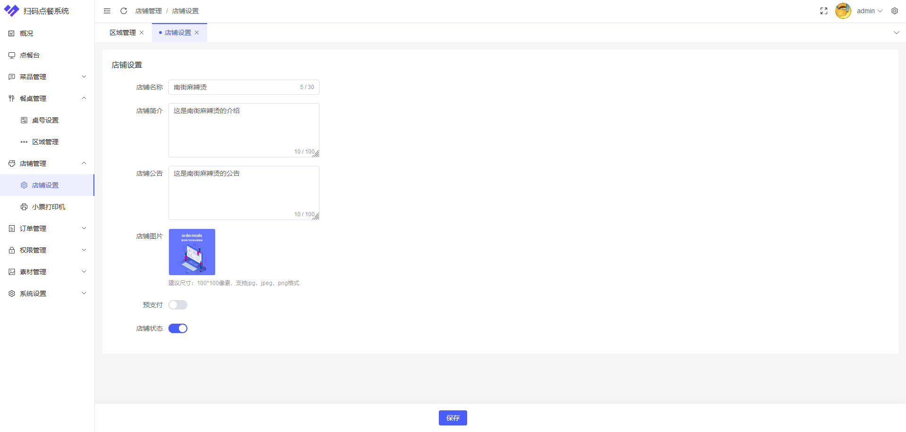
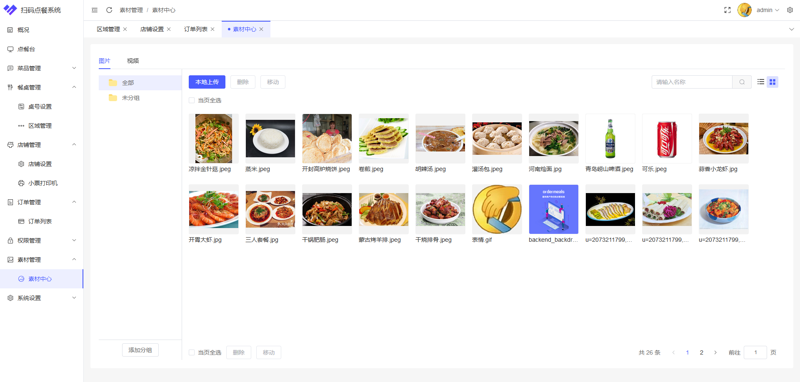
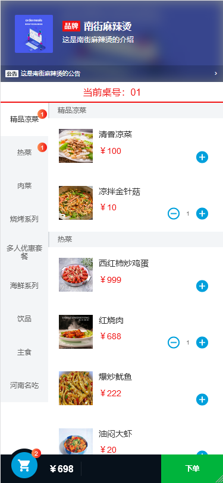

# 多商户SaaS版扫码点餐系统（后端）

### 介绍
（后端）多商户SaaS版扫码点餐系统，支持后台点餐、多人同时在线点餐、购物车共享、餐桌状态实时监控，菜品管理、餐桌管理等众多功能。

| 项目  | 仓库地址 |
|-----|------------------------------------------------|
| 后端  | https://gitee.com/ah-f/Afly-OrderMeals-backend |
| 前端  | https://gitee.com/ah-f/Afly-OrderMeals-front   |
| H5端 | https://gitee.com/ah-f/Afly-OrderMeals-h5      |

系统运行大致流程

### 技术架构

#### 前端
1. 商户管理端使用VUE3版本，顾客点餐端使用VUE2版本。
2. Vue Router：是 Vue框架的路由模块。
3. ElementUI Plus：一款基于vue3的组件库，开箱即用。搭配VUE来实现商户管理端的页面设计。
4. Pinia：全局状态管理器，它允许您跨组件或者页面共享状态。
5. Tailwind CSS：一款响应式设计的前端css框架。
6. cube-ui：基于Vue框架实现的移动端组件库。使用起来简单、便捷，主要用来实现顾客点餐端的界面。
7. ECharts：数据图表组件库，开箱即用，方便快捷。用在商户管理端通过图表查看店铺数据。
8. TypeScript：在JavaScript的基础上做出了升级，新增了面向对象语法。
9. Axios：基于Promise的网络请求库，异步请求结合vue实现页面局部刷新。
#### 后端
1. Spring Boot：当前非常流行的后端开源框架，在spring核心之上只对配置做了升级，不改变核心，开发者开箱即用。
2. MyBatis：数据持久化框架，对数据库连接、配置等操作进行了自动化装配，只需要进行简单的配置就可以实现自动注册驱动、建立连接、释放连接等操作。
3. MyBatis-Plus：MyBatis 的增强工具，只做增强不做改变，只为简化开发、提高效率[9]。
4. MyBatis-Plus-Join：MyBatis-Plus的增强工具，支持了多表联查。
5. Sa-Token：轻量级 Java 权限认证框架，解决登录认证、权限认证、单点登录等一系列权限相关问题。
6. Redis：基于内存的Key-Value型数据库，性能强悍。

### 系统功能

1. 手机扫码点餐功能：用户可以通过扫描二维码或者搜索菜品名称，选择菜品并下单。
2. 多人在线同时点餐：大部分情况都是多人同时点餐，系统需要满足顾客在同一个餐桌下共享菜单，共享购物车，包括订单也是共享一个订单，这样才不会引起系统冲突。
3. 商户前台点餐功能：商户管理端也有点餐功能，商户可以帮助顾客点餐，而并不是只能顾客扫码点餐。
4. 餐桌状态实时监控：餐桌的使用情况可以实时的展示出来，无需手动刷新，同时也方便顾客查看餐桌的使用情况，快速寻找可用餐桌。
5. 菜品管理：商户可以在管理端对店铺中的菜品进行管理，例如可以对菜品进行增加、修改和删除等功能。
6. 菜品分类管理：设置菜品包含的分类，商户点餐端可以根据分类快速查找商品，同时顾客点餐端也会根据菜品分类展示菜品。
7. 桌号管理：商户可以对店铺中的就餐桌进行编号，并录入到系统中，就可以通过系统对餐桌进行管理。
8. 区域管理：对餐桌的分布位置进行管理，使商户更加方便的进行管理。
9. 生成餐桌二维码：商户可以针对某一桌号生成当前餐桌的二维码，用户扫描后就可以针对当前餐桌进行点餐。
10. 店铺数据统计：餐厅可以通过扫码点餐系统统计订单数据，包括销售额、菜品销量等。
11. 店铺设置：商户可以设置店铺的一些展示信息，例如店名、介绍、公告等信息。这些信息同时会展示在顾客点餐端。
12. 小票打印机管理：商户可以绑定小票打印机，当有订单时就会自动打印当前订单的一些信息。

## 系统截图

#### 管理员默认账号
 **admin/123456** 